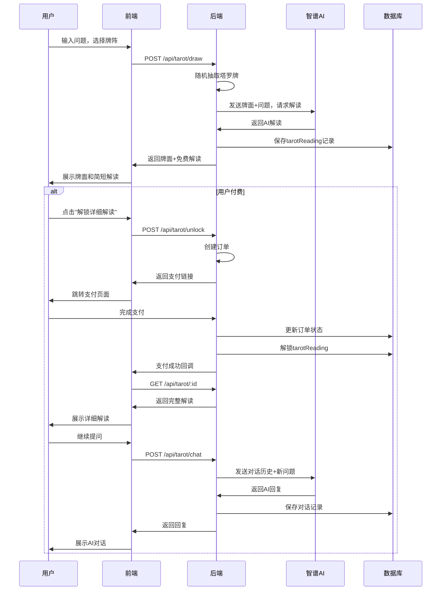
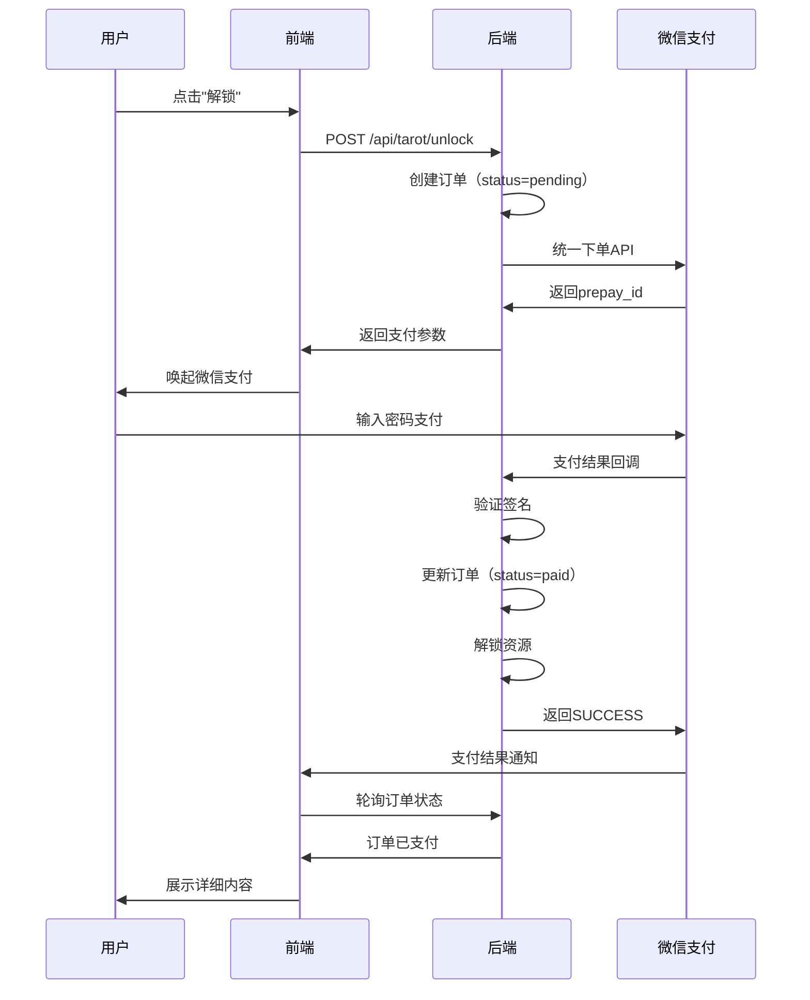

# AI命运守护神 - 系统详细设计文档

**项目名称：** AI命运守护神  
**版本：** V1.0  
**创建日期：** 2026-03-08  
**设计师：** OpenClaw 🦞  

---

## 一、数据库详细设计

### 1.1 用户表（users）

#### 字段设计
```javascript
{
  _id: ObjectId,                    // 主键
  openid: {                         // 微信openid
    type: String,
    required: true,
    unique: true,
    index: true
  },
  unionid: String,                  // 微信unionid（可选）
  phone: {                          // 手机号
    type: String,
    sparse: true,                   // 允许空值
    unique: true
  },
  nickname: {                       // 昵称
    type: String,
    default: '神秘用户'
  },
  avatar: {                         // 头像URL
    type: String,
    default: '/images/default-avatar.png'
  },
  gender: {                         // 性别：0-未知 1-男 2-女
    type: Number,
    enum: [0, 1, 2],
    default: 0
  },
  zodiac: {                         // 星座
    type: String,
    enum: ['aries', 'taurus', 'gemini', 'cancer', 'leo', 'virgo',
           'libra', 'scorpio', 'sagittarius', 'capricorn', 
           'aquarius', 'pisces']
  },
  birthDate: Date,                  // 出生日期
  birthTime: String,                // 出生时间（时辰）
  birthPlace: String,               // 出生地点
  
  // 会员信息
  isMember: {                       // 是否会员
    type: Boolean,
    default: false
  },
  memberLevel: {                    // 会员等级
    type: Number,
    default: 0                      // 0-普通 1-月卡 2-季卡 3-年卡
  },
  memberExpireAt: Date,             // 会员到期时间
  
  // 账户信息
  balance: {                        // 余额（分）
    type: Number,
    default: 0,
    min: 0
  },
  totalSpent: {                     // 累计消费（分）
    type: Number,
    default: 0,
    min: 0
  },
  
  // 统计信息
  tarotCount: {                     // 塔罗占卜次数
    type: Number,
    default: 0
  },
  zodiacCount: {                    // 星座查询次数
    type: Number,
    default: 0
  },
  baziCount: {                      // 八字测算次数
    type: Number,
    default: 0
  },
  
  // 设备信息
  lastLoginAt: Date,                // 最后登录时间
  lastLoginIp: String,              // 最后登录IP
  deviceInfo: {                     // 设备信息
    platform: String,               // 平台：ios/android/web
    model: String,                  // 设备型号
    osVersion: String,              // 系统版本
    appVersion: String              // 应用版本
  },
  
  // 元数据
  status: {                         // 账号状态
    type: String,
    enum: ['active', 'banned', 'deleted'],
    default: 'active'
  },
  createdAt: {
    type: Date,
    default: Date.now
  },
  updatedAt: {
    type: Date,
    default: Date.now
  }
}

// 索引
db.users.createIndex({ openid: 1 }, { unique: true })
db.users.createIndex({ phone: 1 }, { sparse: true, unique: true })
db.users.createIndex({ createdAt: -1 })
db.users.createIndex({ lastLoginAt: -1 })
```

### 1.2 订单表（orders）

#### 字段设计
```javascript
{
  _id: ObjectId,
  orderNo: {                        // 订单号（唯一）
    type: String,
    required: true,
    unique: true,
    index: true
  },
  userId: {                         // 用户ID
    type: ObjectId,
    ref: 'User',
    required: true,
    index: true
  },
  
  // 订单类型
  type: {                           // 订单类型
    type: String,
    enum: ['tarot', 'zodiac', 'bazi', 'member', 'recharge'],
    required: true
  },
  subType: String,                  // 子类型：single/three/celtic等
  
  // 金额信息
  amount: {                         // 订单金额（分）
    type: Number,
    required: true,
    min: 0
  },
  discountAmount: {                 // 优惠金额（分）
    type: Number,
    default: 0
  },
  actualAmount: {                   // 实际支付金额（分）
    type: Number,
    required: true
  },
  
  // 支付信息
  payMethod: {                      // 支付方式
    type: String,
    enum: ['wechat', 'alipay', 'balance'],
    required: true
  },
  payStatus: {                      // 支付状态
    type: String,
    enum: ['pending', 'paid', 'failed', 'refunded'],
    default: 'pending'
  },
  payTime: Date,                    // 支付时间
  transactionId: String,            // 第三方交易号
  
  // 退款信息
  refundStatus: {                   // 退款状态
    type: String,
    enum: ['none', 'processing', 'refunded', 'failed'],
    default: 'none'
  },
  refundAmount: Number,             // 退款金额（分）
  refundTime: Date,                 // 退款时间
  refundReason: String,             // 退款原因
  
  // 关联数据
  resourceId: ObjectId,             // 关联资源ID（tarotReading/zodiacLog等）
  extra: {                          // 扩展信息
    question: String,               // 用户问题
    zodiac: String,                 // 星座
    memberDays: Number              // 会员天数
  },
  
  // 元数据
  createdAt: {
    type: Date,
    default: Date.now
  },
  updatedAt: {
    type: Date,
    default: Date.now
  }
}

// 索引
db.orders.createIndex({ orderNo: 1 }, { unique: true })
db.orders.createIndex({ userId: 1, createdAt: -1 })
db.orders.createIndex({ payStatus: 1, createdAt: -1 })
db.orders.createIndex({ transactionId: 1 }, { sparse: true })
```

### 1.3 塔罗解读表（tarot_readings）

#### 字段设计
```javascript
{
  _id: ObjectId,
  userId: {                         // 用户ID
    type: ObjectId,
    ref: 'User',
    required: true,
    index: true
  },
  
  // 占卜信息
  spreadType: {                     // 牌阵类型
    type: String,
    enum: ['single', 'three', 'celtic'],
    required: true
  },
  question: {                       // 用户问题
    type: String,
    required: true,
    maxlength: 200
  },
  
  // 牌面信息
  cards: [{                         // 抽取的牌
    name: {                         // 牌名
      type: String,
      required: true
    },
    arcana: {                       // 大小阿卡纳
      type: String,
      enum: ['major', 'minor']
    },
    suit: String,                   // 花色：wands/cups/swords/pentacles
    number: Number,                 // 编号
    isReversed: {                   // 是否逆位
      type: Boolean,
      default: false
    },
    position: {                     // 位置
      type: String,
      required: true                // past/present/future等
    },
    imageUrl: String                // 牌面图片URL
  }],
  
  // 解读内容
  interpretation: {                 // AI解读（完整版）
    type: String,
    required: true
  },
  freeInterpretation: {             // 免费解读（简短版）
    type: String,
    required: true
  },
  summary: String,                  // 总结
  
  // 付费信息
  isPaid: {                         // 是否付费
    type: Boolean,
    default: false
  },
  orderId: {                        // 关联订单ID
    type: ObjectId,
    ref: 'Order'
  },
  
  // 对话记录
  chatMessages: [{                  // AI对话记录
    role: {
      type: String,
      enum: ['user', 'assistant']
    },
    content: String,
    timestamp: {
      type: Date,
      default: Date.now
    }
  }],
  
  // 元数据
  isPublic: {                       // 是否公开（分享）
    type: Boolean,
    default: false
  },
  shareCode: String,                // 分享码
  viewCount: {                      // 查看次数
    type: Number,
    default: 0
  },
  createdAt: {
    type: Date,
    default: Date.now
  }
}

// 索引
db.tarot_readings.createIndex({ userId: 1, createdAt: -1 })
db.tarot_readings.createIndex({ shareCode: 1 }, { sparse: true, unique: true })
db.tarot_readings.createIndex({ isPublic: 1, createdAt: -1 })
```

### 1.4 星座日志表（zodiac_logs）

#### 字段设计
```javascript
{
  _id: ObjectId,
  userId: {                         // 用户ID
    type: ObjectId,
    ref: 'User',
    index: true
  },
  zodiac: {                         // 星座
    type: String,
    required: true,
    enum: ['aries', 'taurus', 'gemini', 'cancer', 'leo', 'virgo',
           'libra', 'scorpio', 'sagittarius', 'capricorn', 
           'aquarius', 'pisces']
  },
  
  // 运势日期
  type: {                           // 运势类型
    type: String,
    enum: ['daily', 'weekly', 'monthly'],
    default: 'daily'
  },
  date: {                           // 运势日期
    type: String,
    required: true                  // 格式：2026-03-08
  },
  
  // 运势内容
  scores: {                         // 运势分数
    love: {                         // 爱情运
      type: Number,
      min: 1,
      max: 5
    },
    career: {                       // 事业运
      type: Number,
      min: 1,
      max: 5
    },
    money: {                        // 财运
      type: Number,
      min: 1,
      max: 5
    },
    health: {                       // 健康运
      type: Number,
      min: 1,
      max: 5
    }
  },
  
  summary: {                        // 总体运势概述
    type: String,
    required: true
  },
  detail: {                         // 详细解读（付费）
    love: String,                   // 爱情详细
    career: String,                 // 事业详细
    money: String,                  // 财运详细
    advice: [String]                // 开运建议
  },
  
  // 付费信息
  isPaid: {                         // 是否付费解锁
    type: Boolean,
    default: false
  },
  orderId: {                        // 关联订单
    type: ObjectId,
    ref: 'Order'
  },
  
  // 元数据
  createdAt: {
    type: Date,
    default: Date.now
  }
}

// 索引（复合唯一索引：用户+星座+日期）
db.zodiac_logs.createIndex(
  { userId: 1, zodiac: 1, date: 1 }, 
  { unique: true, sparse: true }
)
db.zodiac_logs.createIndex({ zodiac: 1, date: 1 })
```

### 1.5 八字测算表（bazi_readings）

#### 字段设计
```javascript
{
  _id: ObjectId,
  userId: {                         // 用户ID
    type: ObjectId,
    ref: 'User',
    required: true,
    index: true
  },
  
  // 出生信息
  birthDate: {                      // 出生日期
    type: Date,
    required: true
  },
  birthTime: {                      // 出生时间（时辰）
    type: String,
    required: true                  // 子/丑/寅...
  },
  birthPlace: String,               // 出生地点
  gender: {                         // 性别
    type: Number,
    enum: [1, 2]                    // 1-男 2-女
  },
  
  // 八字信息
  bazi: {                           // 八字四柱
    year: String,                   // 年柱：庚午
    month: String,                  // 月柱：戊寅
    day: String,                    // 日柱：甲午
    hour: String                    // 时柱：己巳
  },
  
  // 五行分析
  wuxing: {                         // 五行分布
    gold: Number,                   // 金
    wood: Number,                   // 木
    water: Number,                  // 水
    fire: Number,                   // 火
    earth: Number                   // 土
  },
  wuxingLack: [String],             // 缺失的五行
  
  // 命理信息
  shengxiao: String,                // 生肖
  nayin: String,                    // 纳音
  xingzuo: String,                  // 星座
  
  // 解读内容
  character: {                      // 性格特点
    type: String,
    required: true
  },
  career: String,                   // 事业分析
  wealth: String,                   // 财运分析
  marriage: String,                 // 婚姻分析
  health: String,                   // 健康分析
  
  // 开运建议
  advice: {
    colors: [String],               // 幸运颜色
    numbers: [Number],              // 幸运数字
    directions: [String],           // 吉祥方位
    stones: [String],               // 开运宝石
    career: [String]                // 适合职业
  },
  
  // 付费信息
  isPaid: {                         // 是否付费
    type: Boolean,
    default: false
  },
  orderId: {
    type: ObjectId,
    ref: 'Order'
  },
  
  // 元数据
  createdAt: {
    type: Date,
    default: Date.now
  }
}

// 索引
db.bazi_readings.createIndex({ userId: 1, createdAt: -1 })
```

---

## 二、API接口详细设计

### 2.1 认证模块

#### POST /api/auth/wechat-login
**功能：** 微信登录  
**权限：** 公开  

**请求参数：**
```json
{
  "code": "微信授权code",
  "userInfo": {                     // 可选
    "nickName": "昵称",
    "avatarUrl": "头像URL",
    "gender": 1
  }
}
```

**响应数据：**
```json
{
  "code": 200,
  "message": "登录成功",
  "data": {
    "token": "eyJhbGciOiJIUzI1NiIsInR5cCI6IkpXVCJ9...",
    "expiresIn": 604800,            // 7天（秒）
    "user": {
      "id": "507f1f77bcf86cd799439011",
      "openid": "oXXXX",
      "nickname": "神秘用户",
      "avatar": "https://...",
      "isMember": false,
      "balance": 0
    }
  }
}
```

**业务逻辑：**
```javascript
1. 验证微信code有效性
2. 获取openid和session_key
3. 查询用户是否存在
   - 存在：更新登录信息
   - 不存在：创建新用户
4. 生成JWT token（有效期7天）
5. 返回token和用户信息
```

---

### 2.2 星座模块

#### GET /api/zodiac/:name/daily
**功能：** 获取每日星座运势  
**权限：** 公开（部分内容需付费）

**路径参数：**
- name: 星座名称（aries/taurus/...）

**查询参数：**
- date: 日期（可选，默认今天）

**响应数据：**
```json
{
  "code": 200,
  "data": {
    "zodiac": "aries",
    "zodiacName": "白羊座",
    "date": "2026-03-08",
    "element": "火象星座",
    "ruler": "火星",
    
    "scores": {
      "love": 4,
      "career": 3,
      "money": 5,
      "health": 4
    },
    
    "summary": "今日整体运势不错，特别是在财运方面...",
    
    "luckyItems": {
      "color": "红色",
      "number": 9,
      "direction": "东南"
    },
    
    "free": {
      "advice": "建议多关注人际关系的维护..."
    },
    
    "paid": {
      "isUnlocked": false,
      "preview": "详细解读包含爱情、事业、财运三个维度的深度分析...",
      "price": 990                      // 价格（分）
    }
  }
}
```

#### POST /api/zodiac/unlock
**功能：** 解锁星座详细解读  
**权限：** 需登录

**请求参数：**
```json
{
  "zodiac": "aries",
  "date": "2026-03-08",
  "payMethod": "wechat"              // wechat/alipay/balance
}
```

**响应数据：**
```json
{
  "code": 200,
  "data": {
    "orderId": "ORD202603081234567",
    "amount": 990,
    "payUrl": "weixin://wxpay/...",  // 支付链接
    "qrcodeUrl": "https://..."       // 支付二维码
  }
}
```

---

### 2.3 塔罗模块

#### POST /api/tarot/draw
**功能：** 抽取塔罗牌  
**权限：** 需登录

**请求参数：**
```json
{
  "spreadType": "three",             // single/three/celtic
  "question": "我最近的感情运势如何？",
  "shuffleMethod": "random"          // random/manual
}
```

**响应数据：**
```json
{
  "code": 200,
  "data": {
    "readingId": "507f1f77bcf86cd799439012",
    "spreadType": "three",
    "question": "我最近的感情运势如何？",
    
    "cards": [
      {
        "name": "The Fool",
        "nameZh": "愚者",
        "arcana": "major",
        "number": 0,
        "isReversed": false,
        "position": "past",
        "imageUrl": "https://.../fool.jpg",
        "keyword": "新开始、冒险、纯真"
      },
      {
        "name": "The Lovers",
        "nameZh": "恋人",
        "arcana": "major",
        "number": 6,
        "isReversed": true,
        "position": "present",
        "imageUrl": "https://.../lovers-reversed.jpg",
        "keyword": "选择、诱惑、价值观"
      },
      {
        "name": "The Sun",
        "nameZh": "太阳",
        "arcana": "major",
        "number": 19,
        "isReversed": false,
        "position": "future",
        "imageUrl": "https://.../sun.jpg",
        "keyword": "成功、快乐、活力"
      }
    ],
    
    "freeInterpretation": "牌面显示，你正处在一个重要的转折点...",
    
    "paid": {
      "isUnlocked": false,
      "preview": "详细解读将为你分析每张牌的具体含义...",
      "price": 990
    }
  }
}
```

#### POST /api/tarot/unlock
**功能：** 解锁塔罗详细解读  
**权限：** 需登录

**请求参数：**
```json
{
  "readingId": "507f1f77bcf86cd799439012",
  "payMethod": "wechat"
}
```

**响应数据：**
```json
{
  "code": 200,
  "data": {
    "orderId": "ORD202603081234568",
    "amount": 990,
    "payUrl": "weixin://wxpay/..."
  }
}
```

#### POST /api/tarot/chat
**功能：** AI对话（付费用户专属）  
**权限：** 需登录 + 已付费

**请求参数：**
```json
{
  "readingId": "507f1f77bcf86cd799439012",
  "message": "我想了解更多关于恋人牌逆位的含义"
}
```

**响应数据：**
```json
{
  "code": 200,
  "data": {
    "reply": "恋人牌逆位在感情占卜中通常暗示着...",
    "chatHistory": [
      {
        "role": "user",
        "content": "我想了解更多关于恋人牌逆位的含义",
        "timestamp": "2026-03-08T10:30:00Z"
      },
      {
        "role": "assistant",
        "content": "恋人牌逆位在感情占卜中通常暗示着...",
        "timestamp": "2026-03-08T10:30:02Z"
      }
    ]
  }
}
```

---

### 2.4 八字模块

#### POST /api/bazi/calculate
**功能：** 计算八字  
**权限：** 需登录

**请求参数：**
```json
{
  "birthDate": "1990-05-15",
  "birthTime": "午时",              // 子/丑/寅/卯/辰/巳/午/未/申/酉/戌/亥
  "gender": 1,                      // 1-男 2-女
  "birthPlace": "北京"              // 可选
}
```

**响应数据：**
```json
{
  "code": 200,
  "data": {
    "readingId": "507f1f77bcf86cd799439013",
    
    "birthInfo": {
      "birthDate": "1990-05-15",
      "birthTime": "午时",
      "solarTerm": "立夏后"
    },
    
    "bazi": {
      "year": "庚午",
      "month": "辛巳",
      "day": "丙申",
      "hour": "甲午"
    },
    
    "wuxing": {
      "gold": 3,
      "wood": 1,
      "water": 0,
      "fire": 3,
      "earth": 1
    },
    "wuxingLack": ["水"],
    
    "shengxiao": "马",
    "nayin": "路旁土",
    "xingzuo": "金牛座",
    
    "free": {
      "character": "你的性格热情开朗，充满活力..."
    },
    
    "paid": {
      "isUnlocked": false,
      "preview": "详细解读包含事业、财运、婚姻、健康全方位分析...",
      "price": 1990                   // 19.9元
    }
  }
}
```

---

### 2.5 支付模块

#### POST /api/pay/create
**功能：** 创建支付订单  
**权限：** 需登录

**请求参数：**
```json
{
  "orderId": "ORD202603081234567",
  "payMethod": "wechat"
}
```

**响应数据：**
```json
{
  "code": 200,
  "data": {
    "prepayId": "wx1234567890",
    "payUrl": "weixin://wxpay/...",
    "qrcodeUrl": "https://api.pay.com/qrcode/...",
    "expireTime": "2026-03-08T10:45:00Z"
  }
}
```

#### POST /api/pay/callback/wechat
**功能：** 微信支付回调  
**权限：** 微信服务器

**请求参数：**
```xml
<xml>
  <appid>wx1234567890</appid>
  <out_trade_no>ORD202603081234567</out_trade_no>
  <transaction_id>4200001234567890</transaction_id>
  <total_fee>990</total_fee>
  <time_end>20260308103000</time_end>
  <sign>...</sign>
</xml>
```

**响应数据：**
```xml
<xml>
  <return_code>SUCCESS</return_code>
  <return_msg>OK</return_msg>
</xml>
```

**业务逻辑：**
```javascript
1. 验证签名
2. 查询订单状态（防重复通知）
3. 更新订单状态为paid
4. 解锁对应资源（tarotReading/zodiacLog等）
5. 发送支付成功通知（可选）
6. 返回SUCCESS给微信
```

---

### 2.6 用户模块

#### GET /api/user/profile
**功能：** 获取用户信息  
**权限：** 需登录

**响应数据：**
```json
{
  "code": 200,
  "data": {
    "id": "507f1f77bcf86cd799439011",
    "nickname": "神秘用户",
    "avatar": "https://...",
    "phone": "138****1234",
    "zodiac": "aries",
    "birthDate": "1990-05-15",
    
    "isMember": true,
    "memberLevel": 1,
    "memberExpireAt": "2026-04-08T00:00:00Z",
    
    "balance": 5000,                 // 50元（分）
    "totalSpent": 19900,             // 199元
    
    "stats": {
      "tarotCount": 15,
      "zodiacCount": 30,
      "baziCount": 2
    },
    
    "recentReadings": [
      {
        "type": "tarot",
        "question": "我最近的感情运势如何？",
        "createdAt": "2026-03-07T15:30:00Z"
      }
    ]
  }
}
```

---

## 三、核心业务流程

### 3.1 塔罗占卜流程


### 3.2 星座运势生成流程
```javascript
async function generateZodiacFortune(zodiac, date) {
  // 1. 检查缓存
  const cacheKey = `zodiac:${zodiac}:${date}`
  const cached = await redis.get(cacheKey)
  if (cached) return cached
  
  // 2. 基础分数计算（算法）
  const baseScores = calculateBaseScores(zodiac, date)
  
  // 3. AI增强（智谱AI）
  const prompt = buildZodiacPrompt(zodiac, date, baseScores)
  const aiResult = await zhipuAI.generate(prompt)
  
  // 4. 融合结果
  const fortune = {
    zodiac,
    date,
    scores: mergeScores(baseScores, aiResult.scores),
    summary: aiResult.summary,
    detail: aiResult.detail,
    luckyItems: generateLuckyItems(zodiac, date)
  }
  
  // 5. 缓存（24小时）
  await redis.setex(cacheKey, 86400, JSON.stringify(fortune))
  
  // 6. 返回
  return fortune
}

// 基础分数计算（日期哈希算法）
function calculateBaseScores(zodiac, date) {
  const hash = hashCode(zodiac + date)
  return {
    love: (Math.abs(hash % 5)) + 1,
    career: (Math.abs((hash >> 8) % 5)) + 1,
    money: (Math.abs((hash >> 16) % 5)) + 1
  }
}
```

### 3.3 支付流程


---

## 四、安全设计

### 4.1 JWT认证流程
```javascript
// 生成token
function generateToken(userId) {
  return jwt.sign(
    { 
      userId,
      timestamp: Date.now()
    },
    process.env.JWT_SECRET,
    { 
      expiresIn: '7d',
      issuer: 'ai-fortune'
    }
  )
}

// 验证token中间件
function authMiddleware(req, res, next) {
  const token = req.headers.authorization?.replace('Bearer ', '')
  
  if (!token) {
    return res.status(401).json({ code: 401, message: '未登录' })
  }
  
  try {
    const decoded = jwt.verify(token, process.env.JWT_SECRET)
    req.userId = decoded.userId
    next()
  } catch (err) {
    return res.status(401).json({ code: 401, message: 'Token无效' })
  }
}
```

### 4.2 接口限流
```javascript
const rateLimit = require('express-rate-limit')

// 通用限流：每分钟100次
const generalLimiter = rateLimit({
  windowMs: 60 * 1000,
  max: 100,
  message: { code: 429, message: '请求过于频繁，请稍后再试' }
})

// 支付接口限流：每分钟10次
const payLimiter = rateLimit({
  windowMs: 60 * 1000,
  max: 10,
  message: { code: 429, message: '支付请求过于频繁' }
})

app.use('/api/', generalLimiter)
app.use('/api/pay/', payLimiter)
```

### 4.3 支付安全
```javascript
// 1. 订单幂等性
async function createOrder(userId, type, resourceId) {
  // 检查是否已存在未支付订单
  const existingOrder = await Order.findOne({
    userId,
    type,
    resourceId,
    payStatus: 'pending'
  })
  
  if (existingOrder) {
    return existingOrder  // 返回已存在订单
  }
  
  // 创建新订单
  return await Order.create({...})
}

// 2. 金额验证
async function handlePaymentCallback(callbackData) {
  const order = await Order.findOne({ orderNo: callbackData.out_trade_no })
  
  // 验证金额
  if (order.amount !== callbackData.total_fee) {
    throw new Error('金额不匹配')
  }
  
  // 验证签名
  if (!verifyWechatSign(callbackData)) {
    throw new Error('签名验证失败')
  }
  
  // 处理支付
  await processPayment(order)
}

// 3. 防止重复回调
async function processPayment(order) {
  // 使用MongoDB事务
  const session = await mongoose.startSession()
  session.startTransaction()
  
  try {
    // 再次检查订单状态（防并发）
    const freshOrder = await Order.findById(order._id).session(session)
    if (freshOrder.payStatus === 'paid') {
      await session.abortTransaction()
      return  // 已处理，直接返回
    }
    
    // 更新订单状态
    freshOrder.payStatus = 'paid'
    freshOrder.payTime = new Date()
    await freshOrder.save({ session })
    
    // 解锁资源
    await unlockResource(freshOrder.type, freshOrder.resourceId, session)
    
    await session.commitTransaction()
  } catch (err) {
    await session.abortTransaction()
    throw err
  } finally {
    session.endSession()
  }
}
```

---

## 五、性能优化方案

### 5.1 缓存策略
```javascript
// Redis缓存设计
const CacheStrategy = {
  // 星座运势：每日更新
  zodiac: {
    key: (zodiac, date) => `zodiac:${zodiac}:${date}`,
    ttl: 86400,  // 24小时
    refresh: 'daily'
  },
  
  // 用户信息：1小时
  user: {
    key: (userId) => `user:${userId}`,
    ttl: 3600,
    refresh: 'onUpdate'
  },
  
  // 塔罗解读：永久
  tarot: {
    key: (readingId) => `tarot:${readingId}`,
    ttl: -1,  // 永久
    refresh: 'never'
  }
}

// 缓存读取
async function getCachedData(key, ttl, fetchFunction) {
  const cached = await redis.get(key)
  if (cached) return JSON.parse(cached)
  
  const data = await fetchFunction()
  await redis.setex(key, ttl, JSON.stringify(data))
  return data
}
```

### 5.2 数据库优化
```javascript
// 1. 索引优化
db.orders.createIndex({ userId: 1, createdAt: -1 })
db.tarot_readings.createIndex({ userId: 1, createdAt: -1 })

// 2. 分页查询
async function getUserOrders(userId, page = 1, limit = 20) {
  return await Order.find({ userId })
    .sort({ createdAt: -1 })
    .skip((page - 1) * limit)
    .limit(limit)
    .select('orderNo type amount payStatus createdAt')  // 只返回必要字段
}

// 3. 聚合查询优化
async function getUserStats(userId) {
  return await Order.aggregate([
    { $match: { userId: mongoose.Types.ObjectId(userId), payStatus: 'paid' } },
    { $group: {
      _id: '$type',
      total: { $sum: '$actualAmount' },
      count: { $sum: 1 }
    }}
  ])
}
```

---

## 六、错误处理

### 6.1 错误码定义
```javascript
const ErrorCodes = {
  // 通用错误 1xxx
  1001: '参数错误',
  1002: '请求频繁',
  1003: '服务器内部错误',
  
  // 认证错误 2xxx
  2001: '未登录',
  2002: 'Token无效',
  2003: 'Token已过期',
  
  // 业务错误 3xxx
  3001: '用户不存在',
  3002: '订单不存在',
  3003: '资源未解锁',
  3004: '余额不足',
  
  // 支付错误 4xxx
  4001: '订单已支付',
  4002: '订单已关闭',
  4003: '支付失败',
  
  // AI错误 5xxx
  5001: 'AI服务异常',
  5002: '内容生成失败'
}
```

### 6.2 统一错误处理
```javascript
// 错误处理中间件
function errorHandler(err, req, res, next) {
  logger.error('Error:', err)
  
  const error = {
    code: err.code || 1003,
    message: err.message || '服务器内部错误',
    timestamp: Date.now()
  }
  
  // 开发环境返回堆栈
  if (process.env.NODE_ENV === 'development') {
    error.stack = err.stack
  }
  
  res.status(err.status || 500).json(error)
}

// 统一响应格式
function response(res, data, code = 200, message = '成功') {
  res.json({
    code,
    message,
    data,
    timestamp: Date.now()
  })
}
```

---

**系统设计师：** OpenClaw 🦞  
**审核状态：** 待审核  
**下一阶段：** 代码实现

---

**核心原则：**
> "数据结构 > 算法"  
> "安全第一 > 性能优化"  
> "可维护性 > 过度设计"
